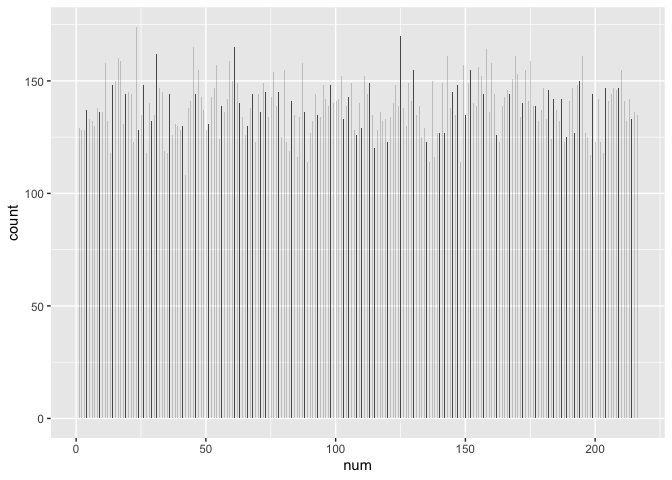

Die Roll Experiment Project
================
Seiji Hirano
2022-09-08

# About

This die roll experiment was introduced in a book written for
beginner-level statistics learners by Yoichi Takahashi, a globally
renowned Japanese economist who has served multiple prime ministers in
policy-making. For more details about Yoichi Takahashi and his
institute, click [here](https://www.highbridgeworld.com/).

# Explanation

Mr. Takahashi used this die roll experiment example to explain about
**histogram**. He says in the book that…

-   If you roll one fair die three times, a combination of the three
    numbers has 216 outcomes (lowest:111, highest:666).
-   This means that there is the probability of 0.00463 (1/216) of
    getting each combination.
-   For this experiment, you number each combination from 1 through 216
    (111 \<- No.1, 112 \<- No.2, …, 666 \<- No.216)
-   Mr. Takahashi says that **if you repeat rolling a die and get a
    combination 30,000 times, all combinations will be picked with
    approximately the same frequency (around 139 times which is
    30,000/216).**
-   The key is that when all outcomes have an equal chance of occurring
    (discrete uniform distribution) like rolling a fair die, **the more
    samples you get, the smaller the variability of getting each
    outcome.**

As a beginner data analyst, I decided to conduct this experiment by
myself with R and see if I can get the same result as explained in the
book!

## Setting Up My Environment

Setting up my environment by loading the ‘tidyverse’ package.

``` r
library(tidyverse)
```

    ## ── Attaching packages ─────────────────────────────────────── tidyverse 1.3.2 ──
    ## ✔ ggplot2 3.3.6     ✔ purrr   0.3.4
    ## ✔ tibble  3.1.8     ✔ dplyr   1.0.9
    ## ✔ tidyr   1.2.0     ✔ stringr 1.4.0
    ## ✔ readr   2.1.2     ✔ forcats 0.5.1
    ## ── Conflicts ────────────────────────────────────────── tidyverse_conflicts() ──
    ## ✖ dplyr::filter() masks stats::filter()
    ## ✖ dplyr::lag()    masks stats::lag()

## Creating a Numbered-List-of-Combinations Table

### List of Combinations

I first created a table that contains **216 outcomes.**

``` r
list.of.comb <- expand.grid(die1=c(1:6), die2=c(1:6),die3=c(1:6))

head(list.of.comb,10)
```

    ##    die1 die2 die3
    ## 1     1    1    1
    ## 2     2    1    1
    ## 3     3    1    1
    ## 4     4    1    1
    ## 5     5    1    1
    ## 6     6    1    1
    ## 7     1    2    1
    ## 8     2    2    1
    ## 9     3    2    1
    ## 10    4    2    1

### Numbered List of Combinations

I then numbered each combination from 1 through 216.

``` r
numbered.list <- transmute(list.of.comb, num=seq(from=1,to=216,by=1), comb=as.integer(paste0(list.of.comb$die1,list.of.comb$die2,list.of.comb$die3)))

head(numbered.list)
```

    ##   num comb
    ## 1   1  111
    ## 2   2  211
    ## 3   3  311
    ## 4   4  411
    ## 5   5  511
    ## 6   6  611

## Creating a Die Roll Experiment Table

Here I created a 2nd table that contains **results after getting a
combination 30,000 times.**

``` r
result <- numeric()

for (i in 1:30000) {
  die.roll <- sample(1:6, 3, replace = T)
  combined <- paste0(die.roll[1],die.roll[2],die.roll[3])
  char.to.int <- as.integer(combined)
  result <- c(result, char.to.int)
  df <- as.data.frame(result)
}

head(df)
```

    ##   result
    ## 1    536
    ## 2    561
    ## 3    126
    ## 4    251
    ## 5    143
    ## 6    555

## Joining the Two Tables

I joined numbered-list-of-combinations table & die-roll-experiment table

``` r
joined.table <- merge(df,numbered.list,by.x = "result", by.y = "comb")

head(joined.table)
```

    ##   result num
    ## 1    111   1
    ## 2    111   1
    ## 3    111   1
    ## 4    111   1
    ## 5    111   1
    ## 6    111   1

``` r
tail(joined.table)
```

    ##       result num
    ## 29995    666 216
    ## 29996    666 216
    ## 29997    666 216
    ## 29998    666 216
    ## 29999    666 216
    ## 30000    666 216

## Final Table

I ordered a joined table by ‘num’ and ‘result’ variables.

``` r
final.table <- joined.table %>% 
  group_by(num,result) %>% 
  count()

head(final.table,10)
```

    ## # A tibble: 10 × 3
    ## # Groups:   num, result [10]
    ##      num result     n
    ##    <dbl>  <dbl> <int>
    ##  1     1    111   129
    ##  2     2    211   128
    ##  3     3    311   128
    ##  4     4    411   137
    ##  5     5    511   133
    ##  6     6    611   132
    ##  7     7    121   130
    ##  8     8    221   138
    ##  9     9    321   136
    ## 10    10    421   136

``` r
tail(final.table,10)
```

    ## # A tibble: 10 × 3
    ## # Groups:   num, result [10]
    ##      num result     n
    ##    <dbl>  <dbl> <int>
    ##  1   207    356   147
    ##  2   208    456   146
    ##  3   209    556   147
    ##  4   210    656   155
    ##  5   211    166   141
    ##  6   212    266   132
    ##  7   213    366   142
    ##  8   214    466   133
    ##  9   215    566   136
    ## 10   216    666   135

``` r
mean(final.table$n)
```

    ## [1] 138.8889

Looks like most outcomes are falling within **a range of 120-160
times.** Given that each combination has the probability of **0.00463
(1/216)** of being picked and that each combination should be picked
**about 139 times (30,000 times 0.00463),** these results are likely
correct.

Let’s look at the visualizations to make sure.

## Visualization

### Histogram

``` r
pl <- ggplot(joined.table,aes(x=num))+
  geom_histogram(binwidth = 0.1)

print(pl)
```

<!-- -->

### Density

``` r
pl2 <- ggplot(final.table, aes(x=n)) +
  geom_density(fill="red", alpha=0.2) +
  geom_vline(xintercept = 139)

print(pl2)
```

<!-- -->

-   a vertical line shows the mean value of 139.

Let’s try the entire experience few more times and see if each result
shows similar visualizations.

### Attempt \#2

``` r
result.2 <- numeric()

for (i in 1:30000) {
  die.roll.2 <- sample(1:6, 3, replace = T)
  combined.2 <- paste0(die.roll.2[1],die.roll.2[2],die.roll.2[3])
  char.to.int.2 <- as.integer(combined.2)
  result.2 <- c(result.2, char.to.int.2)
  df.2 <- as.data.frame(result.2)
}

joined.table.2 <- merge(df.2,numbered.list, by.x = "result.2", by.y = "comb")

final.table.2 <- joined.table.2 %>% 
  group_by(num,result.2) %>% 
  count() %>% 
  rename(n.2 = n)
```

``` r
pl.2 <- ggplot(joined.table.2,aes(x=num))+
  geom_histogram(binwidth = 0.1)
print(pl.2)
```

<!-- -->

``` r
pl2.2 <- ggplot(final.table.2, aes(x=n.2)) +
  geom_density(fill="red", alpha=0.2) +
  geom_vline(xintercept = 139)
print(pl2.2)
```

<!-- -->

### Attempt \#3

``` r
result.3 <- numeric()

for (i in 1:30000) {
  die.roll.3 <- sample(1:6, 3, replace = T)
  combined.3 <- paste0(die.roll.3[1],die.roll.3[2],die.roll.3[3])
  char.to.int.3 <- as.integer(combined.3)
  result.3 <- c(result.3, char.to.int.3)
  df.3 <- as.data.frame(result.3)
}

joined.table.3 <- merge(df.3,numbered.list, by.x = "result.3", by.y = "comb")

final.table.3 <- joined.table.3 %>% 
  group_by(num,result.3) %>% 
  count() %>% 
  rename(n.3 = n)
```

``` r
pl.3 <- ggplot(joined.table.3,aes(x=num))+
  geom_histogram(binwidth = 0.1)
print(pl.3)
```

<!-- -->

``` r
pl2.3 <- ggplot(final.table.3, aes(x=n.3)) +
  geom_density(fill="red", alpha=0.2) +
  geom_vline(xintercept = 139)
print(pl2.3)
```

<!-- -->

### Attempt \#4

``` r
result.4 <- numeric()

for (i in 1:30000) {
  die.roll.4 <- sample(1:6, 3, replace = T)
  combined.4 <- paste0(die.roll.4[1],die.roll.4[2],die.roll.4[3])
  char.to.int.4 <- as.integer(combined.4)
  result.4 <- c(result.4, char.to.int.4)
  df.4 <- as.data.frame(result.4)
}

joined.table.4 <- merge(df.4,numbered.list, by.x = "result.4", by.y = "comb")

final.table.4 <- joined.table.4 %>% 
  group_by(num,result.4) %>% 
  count() %>% 
  rename(n.4 = n)
```

``` r
pl.4 <- ggplot(joined.table.4,aes(x=num))+
  geom_histogram(binwidth = 0.1)
print(pl.4)
```

<!-- -->

``` r
pl2.4 <- ggplot(final.table.4, aes(x=n.4)) +
  geom_density(fill="red", alpha=0.2) +
  geom_vline(xintercept = 139)
print(pl2.4)
```

<!-- -->

### Attempt \#5

``` r
result.5 <- numeric()

for (i in 1:30000) {
  die.roll.5 <- sample(1:6, 3, replace = T)
  combined.5 <- paste0(die.roll.5[1],die.roll.5[2],die.roll.5[3])
  char.to.int.5 <- as.integer(combined.5)
  result.5 <- c(result.5, char.to.int.5)
  df.5 <- as.data.frame(result.5)
}

joined.table.5 <- merge(df.5,numbered.list, by.x = "result.5", by.y = "comb")

final.table.5 <- joined.table.5 %>% 
  group_by(num,result.5) %>% 
  count() %>% 
  rename(n.5 = n)
```

``` r
pl.5 <- ggplot(joined.table.5,aes(x=num))+
  geom_histogram(binwidth = 0.1)
print(pl.5)
```

<!-- -->

``` r
pl2.5 <- ggplot(final.table.5, aes(x=n.5)) +
  geom_density(fill="red", alpha=0.2) +
  geom_vline(xintercept = 139)
print(pl2.5)
```

<!-- -->

## Conclusion

**From my die roll experiment, I was able to get the result that backs
up Mr. Takahashi’s explanation in the book!**
